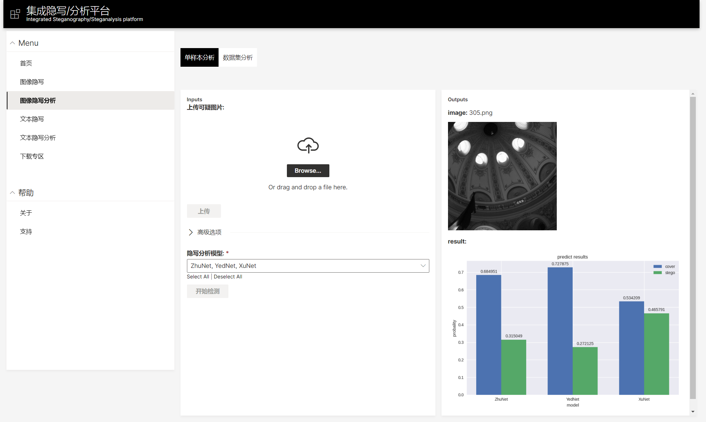

# 集成隐写/分析平台
# 安装教程
1. 下载SDK

https://github.com/h2oai/wave/releases

2. 解压并移动到home目录

`tar -xzf wave-0.13.0-linux-amd64.tar.gz`

`mv wave-0.13.0-linux-amd64 $HOME/wave`

3. 运行服务端进程

在`$HOME/wave`目录下执行`./waved`

4. 运行app进程

在`$HOME/wave`目录下创建文件夹`myapps`，将仓库文件复制进`myapps`文件夹下，在`$HOME/wave/myapps/web`目录下执行`wave run index`即可

# 效果图

